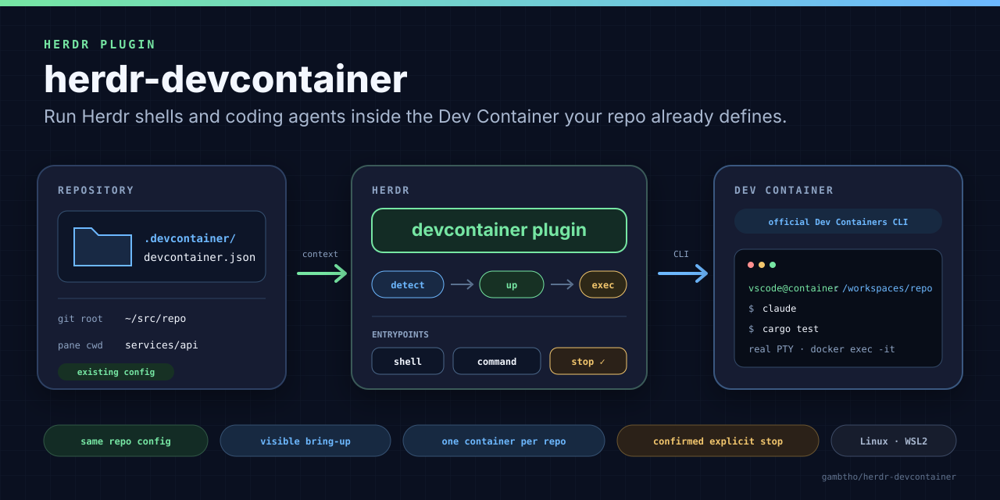

# herdr-devcontainer — Dev Container panes for Herdr

<p align="center">
  <a href="https://github.com/gambtho/herdr-devcontainer/releases/latest"></a>
  <a href="https://herdr.dev/plugins"></a>
  <a href="https://herdr.dev/docs/plugins/"></a>
  
  <a href="LICENSE"></a>
  <a href="https://github.com/gambtho/herdr-devcontainer/actions/workflows/ci.yml"></a>
</p>

<p align="center">
  
</p>

Run [Herdr](https://herdr.dev) shells and coding-agent panes inside the **Dev
Container the repository already defines**. The plugin uses the official
[Dev Containers CLI](https://github.com/devcontainers/cli), keeps
`devcontainer.json` as the source of truth, and requires no editor.

Point it at a repository that carries a Dev Container configuration and it
resolves the repository, brings the container up, maps your current directory to
the matching path inside the container, and replaces itself with a `docker exec`
— so the pane you get is an ordinary interactive shell or agent session, just on
the other side of the container boundary. There is no second container format
and nothing here re-implements `devcontainer.json`.

> **Current boundary:** Linux, including WSL2 — the manifest declares
> `platforms = ["linux"]`. Installing from GitHub compiles the Rust plugin
> locally, so a Rust toolchain must be present. The target directory must be a
> Git repository with a Dev Container configuration, unless that repository is
> explicitly forced on in plugin config.

## Requirements

| | |
|---|---|
| [Herdr](https://herdr.dev) | **0.8.0 or newer** (`min_herdr_version` in the manifest) |
| Platform | Linux or WSL2 |
| Git | any recent version; the plugin shells out to `git worktree list` |
| Docker | with a reachable daemon |
| [Dev Containers CLI](https://github.com/devcontainers/cli) | `npm install -g @devcontainers/cli` |
| Rust and Cargo | **1.74 or newer** (`rust-version` in `Cargo.toml`) |

Rust is required because the plugin manifest's build hook runs:

```sh
cargo build --release
```

The committed `Cargo.lock` is resolved against that minimum rather than against
the newest published dependencies, so a 1.74 toolchain builds this checkout as
it stands. CI verifies the declared minimum on every change, so the number above
cannot drift away from what actually compiles.

## Install

Install the latest reviewed release:

```sh
herdr plugin install gambtho/herdr-devcontainer --ref v0.1.0
```

Herdr clones the tagged source and runs the manifest's `cargo build --release`
hook before registering the plugin. Pass `--yes` to skip the confirmation
prompt.

To follow current development on `main` instead — which is not a release:

```sh
herdr plugin install gambtho/herdr-devcontainer
```

Verify what got registered:

```sh
herdr plugin list --plugin devcontainer
herdr plugin action list --plugin devcontainer
```

For local development, build once yourself first — `herdr plugin link` does
**not** run the manifest build hook:

```sh
cargo build --release
herdr plugin link /path/to/herdr-devcontainer
```

## Entrypoints

Three panes, and one action per pane that opens it from anywhere:

| Pane id | Action id | What it does |
|---|---|---|
| `shell` | `devcontainer.open-shell` | Interactive login shell inside the repository's Dev Container |
| `command` | `devcontainer.open-command` | Runs the configured `command` payload through an interactive login shell inside the container; default `claude` |
| `stop` | `devcontainer.open-stop` | Popup that identifies the repository's container, names it, asks for confirmation, and stops it |

Open a pane directly:

```sh
herdr plugin pane open --plugin devcontainer --entrypoint shell
herdr plugin pane open --plugin devcontainer --entrypoint command
```

Or invoke the equivalent action. The CLI takes the bare action id, with
`--plugin` to disambiguate:

```sh
herdr plugin action invoke open-shell --plugin devcontainer
herdr plugin action invoke open-command --plugin devcontainer
herdr plugin action invoke open-stop --plugin devcontainer
```

Opening a shell or command pane is the explicit lifecycle trigger. Container
lifecycle is never attached to repository events, nothing is stopped
automatically, and the plugin never runs `docker rm` — `stop` stops a container,
it does not remove one.

## Why use it

- **One development environment.** Shells and agents see the same tools,
  dependencies, users, and workspace path the repository's Dev Container already
  defines for everyone else.
- **No duplicated configuration.** The plugin delegates to `devcontainer up`; it
  does not parse or reinterpret `devcontainer.json`.
- **Visible bring-up.** Build and lifecycle-hook output stays in the new pane
  instead of disappearing behind an editor.
- **No editor required.** The official CLI is the only interpreter involved.
- **Serialized startup.** A per-repository `flock` means two panes opened at
  once cannot race through bring-up.
- **Deterministic container selection.** If more than one running container
  claims the repository, the plugin lists them and refuses to guess.
- **Explicit, confirmed shutdown.** Stop is its own action, names the target,
  and proceeds only on `y` or `yes`.

## Keybindings

Bind the fully qualified action id (`<plugin id>.<action id>`):

```toml
[[keys.command]]
key = "prefix+d"
type = "plugin_action"
command = "devcontainer.open-shell"
description = "dev container shell"

[[keys.command]]
key = "prefix+shift+s"
type = "plugin_action"
command = "devcontainer.open-stop"
description = "stop dev container"
```

`prefix+shift+s` for stop is deliberate: Herdr's default `close_workspace`
binding is `prefix+shift+d`, so binding stop to `prefix+D` would put a
destructive plugin action on top of a destructive built-in one.

These are examples, not reserved defaults. Check what your own map already uses
before adopting them — `prefix+?` opens Herdr's help, and `herdr config check`
validates `config.toml` and prints diagnostics.

## Configuration

Optional, at `$XDG_CONFIG_HOME/herdr-devcontainer/config.toml`, falling back to
`~/.config/herdr-devcontainer/config.toml` when `XDG_CONFIG_HOME` is unset or
empty:

```toml
# Any command available inside the container: claude, codex, opencode, ...
command = "claude"

# Ceiling for `devcontainer up`, in seconds.
up_timeout_secs = 300

[repos."/home/you/workspace/foo"]
enabled = "auto"                                 # "auto" (default) | "true" | "false"
config = ".devcontainer/alt/devcontainer.json"   # repo-relative
shell = "/bin/zsh"                               # default: the container user's login shell
env = ["ANTHROPIC_BASE_URL=http://proxy:8080"]   # passed as `docker exec -e`
```

| Setting | Meaning |
|---|---|
| `command` | Payload for the `command` pane; default `claude` |
| `up_timeout_secs` | Bring-up timeout in seconds; default `300` |
| `enabled = "auto"` | Require a Dev Container config at a standard or explicitly configured path |
| `enabled = "true"` | Skip detection entirely and let `devcontainer up` decide what is valid |
| `enabled = "false"` | Refuse to open container panes for that repository |
| `config` | Alternate repo-relative `devcontainer.json` path |
| `shell` | Shell to exec into, overriding the one probed from the container |
| `env` | `KEY=value` assignments passed to `docker exec -e` |

An `env` entry that is not `KEY=value` is dropped with a warning rather than
forwarded: `docker exec -e NAME` with no `=` exports the *host's* variable of
that name into the container, which is never what the setting asked for.

Under `auto`, detection checks, in order:

```text
.devcontainer/devcontainer.json
.devcontainer.json
```

Repo keys are matched against the **canonicalized** repo root. A `config` value
is repo-relative by contract: absolute paths and `..` traversal are rejected in
every mode, including `enabled = "true"`.

Guarantees worth knowing:

- A missing config file means defaults.
- An unreadable one is an **error**, not a silent fallback — a permission or I/O
  failure can never quietly re-enable a repo you set to `enabled = "false"`.
- Unknown keys are warnings, not errors.

## Repository and worktree behavior

The plugin resolves the **main Git worktree** and uses that canonical path as
repository and container identity. That matches the `devcontainer.local_folder`
label the Dev Containers CLI writes itself, and it means every linked worktree
of a repository shares one Dev Container rather than racing to create
independent ones that would collide on ports and similar resources.

That also defines the main limitation:

> A linked worktree checked out **outside** the main repository directory is not
> automatically mounted inside the main repository's container. When the current
> directory cannot be mapped under the repository root, the pane starts at the
> container's workspace root and prints a notice rather than pretending the
> external checkout is available inside the container.

For a current directory underneath the main repository root, the relative host
path is appended to the container's `remoteWorkspaceFolder` and used as the
`docker exec` working directory. That directory comes from Herdr's invocation
context (the focused pane, then the workspace), not from the wrapper's own
working directory — Herdr runs a plugin pane from the *plugin root*, so reading
the process cwd would report every launch as an out-of-repo checkout.

## Environment inside the pane

Panes exec the container user's shell **interactively** — the shell from the
container's passwd entry, `sh` (with a printed note) when that cannot be read or
names `nologin`/`false`. Interactive is the part that matters: `~/.zshrc` and
`~/.bashrc` are sourced only by an interactive shell, and that is where Dev
Container setup scripts put `PATH` entries and API endpoints. A login-only shell
reads `~/.zprofile` and stops, which is how an agent in a container silently
bypasses a configured proxy.

Shells are also started as **login** shells, so `/etc/profile` and `~/.zprofile`
apply — except bash, which is the one shell that reads `~/.bashrc` *only* when
interactive and **not** a login shell. Images that ship a `~/.bashrc` and no
profile file at all are common enough (`devcontainers/base` is one) that adding
`-l` for bash would lose exactly the environment this is here to collect, so
bash gets `-i`/`-ic` and every other shell gets `-li`/`-lic`.

Set `shell` for a repository to override the probe.

What this does **not** do is apply `remoteEnv` from `devcontainer.json`. That
value is a merge of the config file, every Feature's contributed metadata, and
the image's `devcontainer.metadata` label, and `devcontainer up` does not report
the resolved result — so parsing the config file alone would produce a partial
environment that looks authoritative. In practice the pane's shell already
supplies what `remoteEnv` sets, because the same setup scripts write both. When
it does not, list the assignments explicitly in `env`.

## How it works

For a shell or command pane, the wrapper:

1. resolves the repository's main Git worktree from Herdr context, falling back
   to Git on the pane and process working directories;
2. detects the repository's Dev Container configuration;
3. verifies the Dev Containers CLI is on `PATH` and the Docker daemon answers;
4. discovers existing containers by the `devcontainer.local_folder` label;
5. refuses to continue when more than one of them is running;
6. acquires a per-repository lock;
7. runs `devcontainer up` and validates its success result;
8. maps the pane's directory into `remoteWorkspaceFolder`;
9. probes the container user's login shell; and
10. replaces itself with `docker exec -i -t`.

Two rules run through the whole implementation. Host-side subprocesses are
invoked as direct argv arrays with no shell in between, so repository-controlled
paths cannot inject host commands — only the configured payload is interpreted,
by the login shell **inside** the container. And uncertainty is never absence: a
probe that fails, or a `docker ps` line that will not parse, is an error, never
"there is no container."

The full design, including the wrapper flow step by step, is in
[`docs/superpowers/specs/2026-08-11-herdr-devcontainer-plugin-design.md`](docs/superpowers/specs/2026-08-11-herdr-devcontainer-plugin-design.md).

## Trust and security

This plugin is not a security boundary, and opening a Dev Container is not
sandboxing.

- Installing a Herdr plugin runs its build and runtime commands as your user.
  Review [`herdr-plugin.toml`](herdr-plugin.toml) and the source before
  installing code you do not trust.
- `devcontainer up` executes repository-controlled build and lifecycle code —
  `Dockerfile` steps, `postCreateCommand`, and the rest. Opening a Dev Container
  for a repository you do not trust runs that repository's code, exactly as it
  does in VS Code Dev Containers. This plugin inherits that trust model and does
  not add to it.
- What a Dev Container does give you is a *consistent* environment, not an
  isolated one.
- The pane payload never comes from repository content. It is either a plain
  login shell or the command in your own plugin config.

## Development and tests

```sh
cargo build --release
cargo test
cargo test --test integration -- --ignored
```

The ignored integration suite performs a real container bring-up and requires
Docker, the Dev Containers CLI, and `script(1)`.

Nothing in this repository parses `herdr-plugin.toml`, so a green Rust test run
says nothing about the manifest being valid. That is only verified by linking or
installing the plugin into a real Herdr and exercising all three entrypoints.

## Status

The current release is
[`v0.1.0`](https://github.com/gambtho/herdr-devcontainer/releases/tag/v0.1.0),
matching the version in both `Cargo.toml` and the plugin manifest. Pin to it
with `--ref` to install a reviewed revision:

```sh
herdr plugin install gambtho/herdr-devcontainer --ref v0.1.0
```

An install without `--ref` follows the current default branch instead.

## License

MIT. See [LICENSE](LICENSE).
